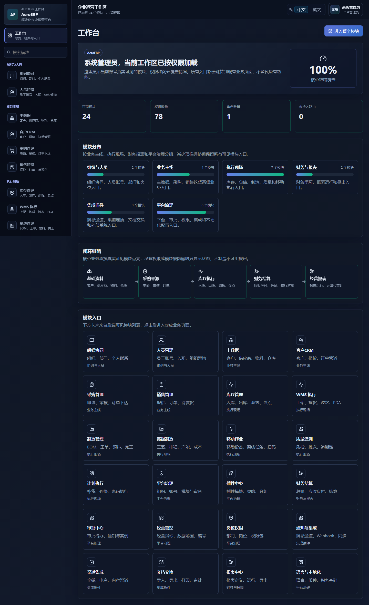
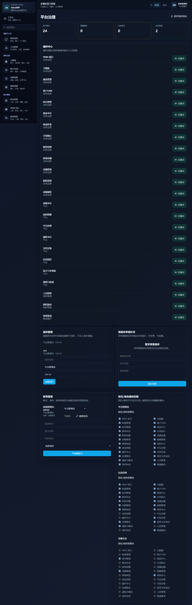
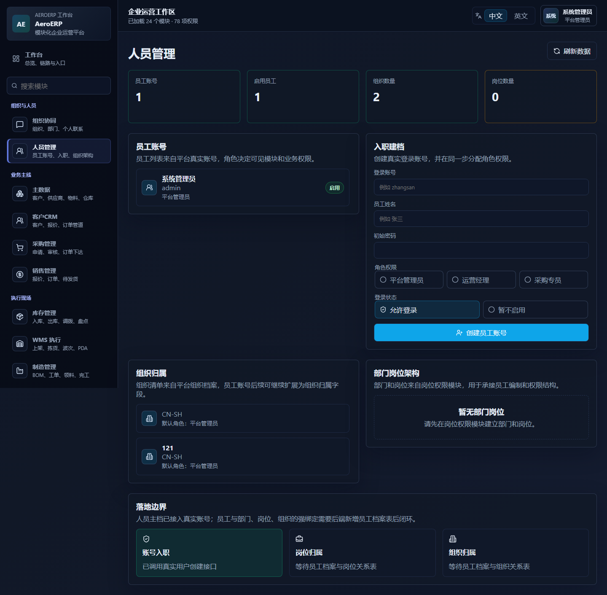
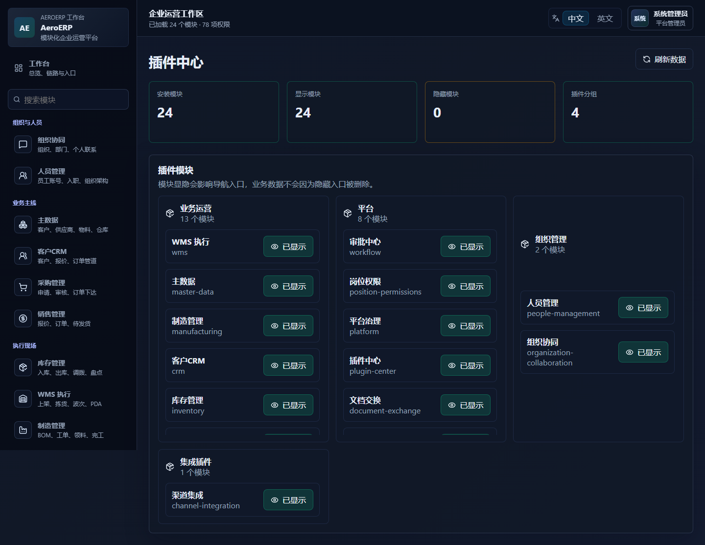
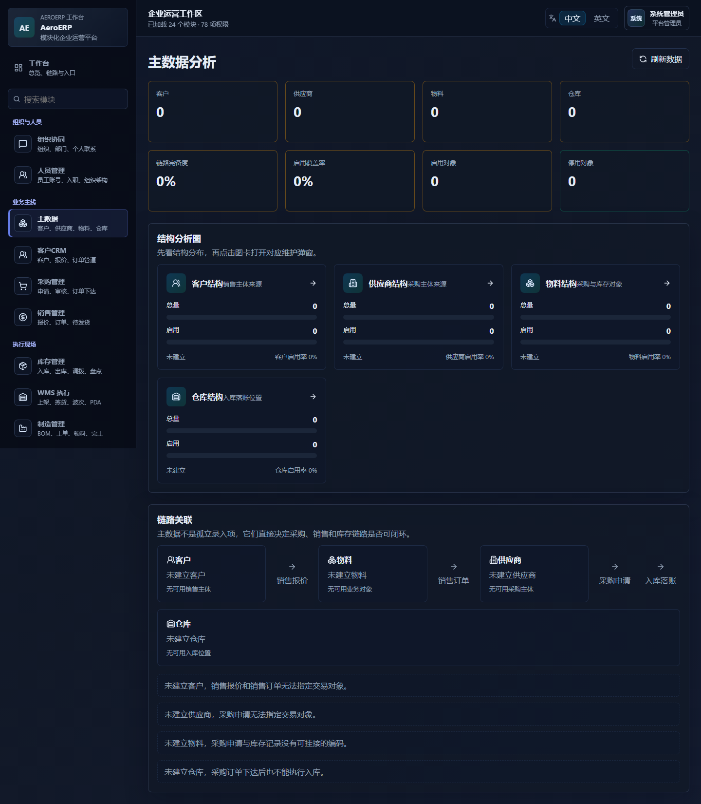
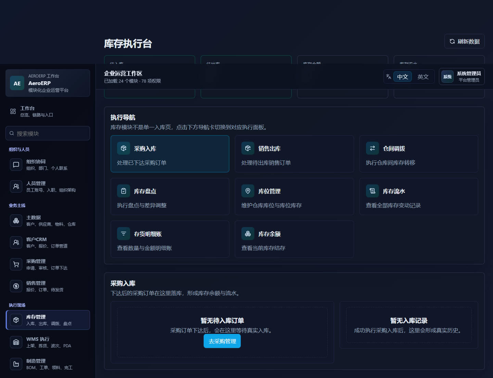
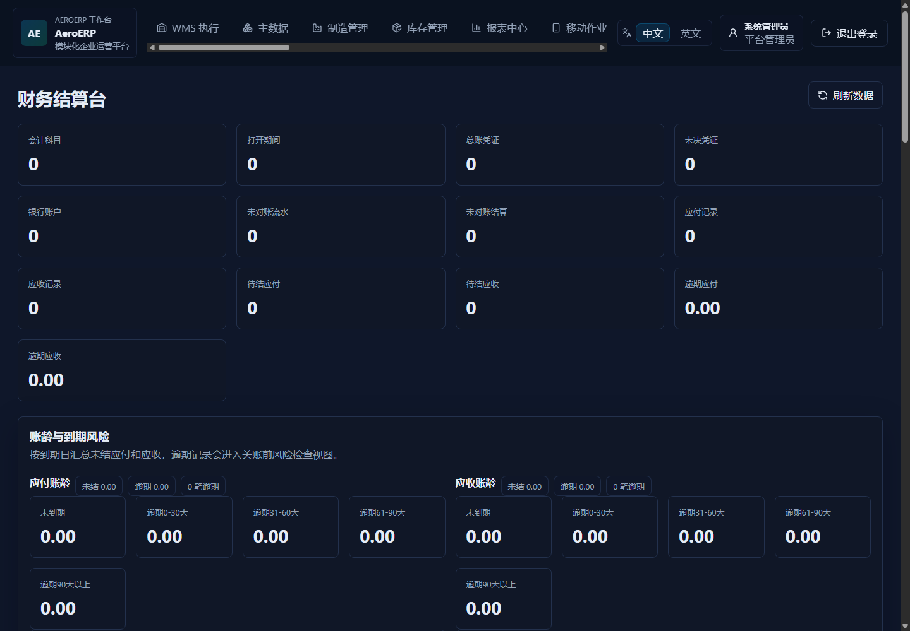
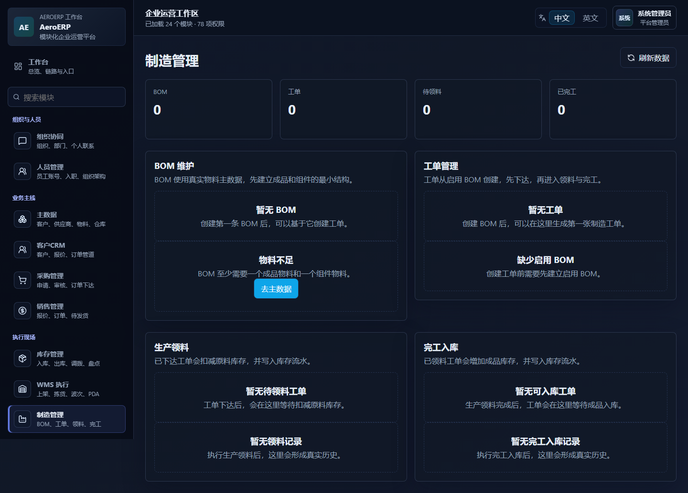
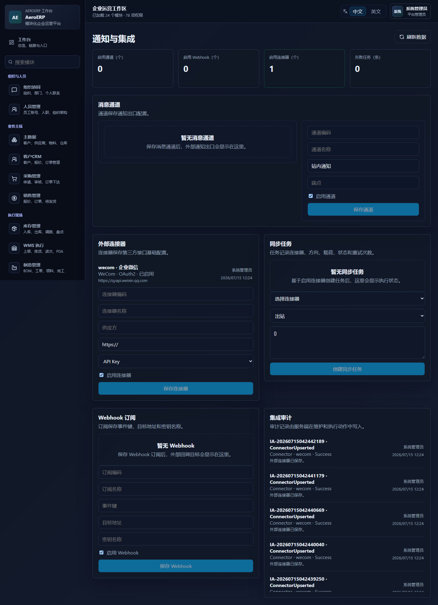

# AeroERP

[English](README.en-US.md) | 中文

AeroERP 是一个全新的模块化 ERP 项目，采用 `.NET 10 + ASP.NET Core` 模块化单体后端，以及 `React + Vite` 前端工作区。界面、动效、共享组件和业务模块职责已拆分，适合继续做插件化二次开发。

## GitHub 项目入口

这是一个面向企业运营场景的模块化 ERP 原型系统，覆盖平台治理、主数据、采购、销售、库存、财务、审批、制造、WMS、质量追溯、计划执行、报表、集成和文档交换等模块。

项目欢迎共创，但不允许随意把代码直接上传到主分支。所有变更应通过功能分支和 Pull Request 审查，具体规则见 [CONTRIBUTING.md](CONTRIBUTING.md) 和 [GitHub 仓库治理说明](docs/GITHUB-GOVERNANCE.md)。

## 快速运行

### 环境要求

- .NET 10 SDK
- Node.js 24+ 与 npm
- 可选：PostgreSQL。未配置时开发环境会自动使用本地 SQLite。

### 启动后端

推荐在仓库根目录启动单文件 AppHost：

```powershell
.\scripts\start-apphost-single.ps1 -StopExisting
```

默认后端地址：

- API：`http://localhost:5099/api`
- Swagger：`http://localhost:5099/swagger`

如果本机没有 Windows 应用控制策略拦截，也可以直接运行：

```powershell
dotnet restore AeroERP.slnx
dotnet run --project src/AeroERP.AppHost --urls http://localhost:5099
```

### 启动前端

```powershell
npm install
npm run dev --workspace @aeroerp/web -- --host 0.0.0.0 --port 5173
```

访问地址：

- Web 工作台：`http://localhost:5173`

默认管理员账号：

```text
账号：admin
密码：Admin@123456
```

该账号只用于系统初始化和本地审查，不会注入业务演示数据。

## 主要模块与使用说明

AeroERP 的模块入口由后端模块可见性和用户权限共同控制。没有权限的模块不会出现在导航中；没有维护权限的页面只展示只读说明或空状态，不保留不可用按钮。

| 模块 | 入口 | 包含内容 | 如何使用 |
| --- | --- | --- | --- |
| 工作台 | `/workspace` | 可见模块、权限数量、业务链路、模块分组入口 | 登录后先进入工作台，确认当前账号能访问哪些模块，再进入对应业务页面。 |
| 平台治理 | `/platform` | 账号、角色、模块显隐、组织、审计事件、智能体审查 | 首次使用先检查管理员账号、角色权限和模块可见性，再创建其他员工账号。 |
| 组织协同 | `/organization-collaboration` | 组织联系人、会话、消息、附件、已读状态 | 从人员联系人发起会话，发送消息或附件，系统记录协同状态。 |
| 人员管理 | `/people-management` | 员工账号、入职建档、组织清单、部门岗位结构 | 使用“入职建档”创建真实登录账号，选择角色按钮和登录状态后提交。 |
| 插件中心 | `/plugin-center` | 插件分组、模块显隐、入口状态 | 查看已安装模块，按权限控制模块是否在导航和入口中显示。 |
| 主数据 | `/master-data` | 客户、供应商、物料、仓库 | 先维护客户、供应商、物料和仓库，后续采购、销售、库存、制造都会引用这些数据。 |
| 客户 CRM | `/crm` | 客户卡片、报价、订单管道 | 查看客户经营状态和销售阶段，跟进报价到订单的销售过程。 |
| 采购管理 | `/procurement` | 采购申请、审核、采购订单、订单下达 | 创建采购申请，审核通过后转采购订单并下达，随后进入库存待入库。 |
| 销售管理 | `/sales` | 销售报价、销售订单、待发货 | 创建报价并转订单，确认后标记待出库，随后进入库存出库。 |
| 库存管理 | `/inventory` | 采购入库、销售出库、调拨、盘点、库位、余额、流水、存货明细账 | 根据采购/销售来源处理入库出库，查看数量、库位和移动加权成本。 |
| WMS 执行 | `/wms` | 上架、拣货、波次、容器、仓内路径、PDA 队列 | 维护仓内执行任务，承接更细粒度的库内作业。 |
| 移动作业 | `/mobile-work` | 移动设备、离线任务、扫码记录、移动队列 | 登记移动设备和离线任务，记录扫码执行结果。 |
| 制造管理 | `/manufacturing` | BOM、工单、生产领料、完工入库、工单成本 | 维护 BOM，创建并下达工单，执行领料和完工入库，系统写入库存成本。 |
| 高级制造 | `/advanced-manufacturing` | 工作中心、工艺路线、工序排程、产能、成本快照、MRP | 建立工艺和产能数据，生成成本快照和物料需求建议。 |
| 计划执行 | `/planning` | 补货建议、外协订单、外协发料/收料、条码执行 | 基于真实库存生成补货建议，处理外协和条码执行闭环。 |
| 质量追溯 | `/quality` | 来源候选、质检记录、批次事件、追溯链查询 | 从入库、完工、出库等真实来源创建质检和批次事件，按批次号查询链路。 |
| 财务结算 | `/finance` | 会计科目、会计期间、凭证、应付、应收、税票、银行账户、结算、对账、报表 | 从业务单据生成应收应付和凭证，审核后查看账龄、试算平衡和基础报表。 |
| 报表中心 | `/reporting` | 报表定义、运行记录、导出任务 | 配置报表定义，运行后生成记录并创建导出任务。 |
| 审批中心 | `/workflow` | 流程定义、流程实例、审批待办、通知 | 处理采购申请等流程待办，审批结果会回写业务单据。 |
| 经营管控 | `/control` | 经营指标、数据范围、编号规则 | 查看真实业务统计，配置角色数据范围和单据编号规则。 |
| 岗位权限 | `/position-permissions` | 部门、岗位、权限包、角色绑定、岗位数据范围 | 维护岗位和权限包，将角色和数据范围绑定到岗位结构。 |
| 语言与本地化 | `/localization` | 币种、税票设置、发票抬头、本地化内容 | 配置币种、税率和税票基础，支撑采购、销售和财务字段。 |
| 通知与集成 | `/integration` | 消息通道、Webhook、外部连接器、同步任务、集成审计 | 配置外部系统连接和同步任务，查看集成执行状态。 |
| 渠道集成 | `/channel-integration` | 企微、电商、内容渠道入口 | 作为外部渠道接入入口，承接后续渠道连接和授权配置。 |
| 文档交换 | `/document-exchange` | 导入模板、字段映射、导入批次、导出任务、打印模板、文件审计 | 配置导入导出和打印任务，保留文件处理审计。 |

## 推荐使用路径

1. 先进入“平台治理”，确认账号、角色、权限和可见模块。
2. 进入“主数据”，维护客户、供应商、物料和仓库。
3. 采购链路：采购申请 -> 审批 -> 采购订单 -> 下达 -> 库存入库 -> 财务应付。
4. 销售链路：销售报价 -> 销售订单 -> 确认/待发货 -> 库存出库 -> 财务应收。
5. 制造链路：BOM -> 工单 -> 领料 -> 完工入库 -> 成本归集。
6. 财务链路：会计期间 -> 凭证制单 -> 审核 -> 结算 -> 对账 -> 报表。
7. 质量、计划、WMS、移动作业和文档交换可在主流程形成真实数据后继续使用。

## 界面截图

截图保存在 [docs/images](docs/images)，截图索引和重新生成方式见 [docs/SCREENSHOTS.md](docs/SCREENSHOTS.md)。

| 登录页 | 工作台 |
| --- | --- |
|  |  |

| 平台治理 | 人员管理 |
| --- | --- |
|  |  |

| 插件中心 | 主数据 |
| --- | --- |
|  |  |

| 库存执行 | 财务工作台 |
| --- | --- |
|  |  |

| 制造管理 | 通知与集成 |
| --- | --- |
|  |  |

## 项目文档

- [English README](README.en-US.md)：English introduction, build, run, and collaboration guide.
- [使用说明](docs/USER-GUIDE.zh-CN.md)：本地运行、登录、操作流程和业务链路。
- [完整操作文档](docs/OPERATION-GUIDE.zh-CN.md)：逐页介绍所有模块界面、功能入口、操作方式、权限状态和业务衔接。
- [User Guide](docs/USER-GUIDE.en-US.md)：English operating guide.
- [模块说明](docs/MODULES.md)：后端模块、前端页面、职责边界和路由元数据。
- [项目约束](docs/PROJECT-CONSTRAINTS.md)：源码结构、产品规则、代码质量、治理和文档约束。
- [共创规范](CONTRIBUTING.md)：分支、PR、验证和禁止提交内容。
- [GitHub 仓库治理说明](docs/GITHUB-GOVERNANCE.md)：主分支保护与 Pull Request 规则。

## 目录结构

- `src/AeroERP.BuildingBlocks`：基础领域对象与底层公共能力
- `src/AeroERP.Platform`：平台契约、身份权限、审查治理规则
- `src/AeroERP.Platform.Infrastructure`：EF Core 持久化、认证实现、运行时服务
- `src/AeroERP.Modules.MasterData`：供应商、物料、仓库
- `src/AeroERP.Modules.Procurement`：采购申请到采购订单闭环
- `src/AeroERP.Modules.Inventory`：采购入库、出库、调拨、盘点、库存余额、库存成本和存货明细账
- `src/AeroERP.Modules.Finance`：会计科目、会计期间、总账凭证、业务凭证、应付、应收、价税分离、税票记录、银行账户、银行流水、结算与对账、基础财务报表
- `src/AeroERP.Modules.Workflow`：工作流定义、审批待办、通知
- `src/AeroERP.Modules.Control`：经营统计、数据范围、编号规则
- `src/AeroERP.Modules.Localization`：组织本地化、币种、税票基础
- `src/AeroERP.Modules.Manufacturing`：BOM、工单、生产领料、完工入库
- `src/AeroERP.Modules.AdvancedManufacturing`：工艺路线、工序计划、产能、成本与 MRP
- `src/AeroERP.Modules.Wms`：上架、拣货、波次、容器、库内路径与 PDA 队列
- `src/AeroERP.Modules.MobileWork`：移动设备、离线任务、扫码记录与移动工作队列
- `src/AeroERP.Modules.Integration`：消息通道、Webhook、外部连接器与同步任务
- `src/AeroERP.Modules.DocumentExchange`：导入模板、字段映射、导出任务、打印模板与文件审计
- `src/AeroERP.Modules.Reporting`：报表定义、运行记录和导出任务
- `src/AeroERP.Modules.Quality`：质检记录、批次事件、追溯查询
- `src/AeroERP.Modules.Planning`：补货建议、外协加工、PDA/条码执行
- `src/AeroERP.AppHost`：后端组合根与 API 启动入口
- `tools/AeroERP.FinanceReportValidation`：财务报表服务级验证工具
- `tools/AeroERP.InventoryCostValidation`：库存成本服务级验证工具
- `packages/ui-style`：设计令牌、动效、基础视觉规范
- `packages/ui-kit`：共享业务 UI 组件
- `apps/web`：主 Web 工作台

## 当前已实现

- 中文界面与中文业务交互
- 真实登录、JWT、账号/角色/模块权限
- 账号生命周期管理：启用、停用、个人改密、管理员重置密码
- 插件模块显隐与导航联动
- 智能体任务提交、审查、决策、审计记录
- 组织管理
- 主数据维护：供应商、物料、仓库
- 采购闭环：申请提交、审核、转单、下达
- 库存闭环：已下达采购订单 -> 入库单 -> 库存余额，并支持仓库库位级库存
- 销售闭环：客户、销售报价、销售订单、销售出库
- 财务闭环：会计科目、会计期间开关账、手工总账凭证、业务单据生成总账凭证、凭证提交审核、来源防重、应付记录、应收记录、价税分离、税票记录、应收应付账龄、银行账户、银行流水、付款/收款结算、银行对账、结算历史、试算平衡、利润表和资产负债表基础口径
- 工作流闭环：采购申请审批待办、审批中心、通知消息
- 管控闭环：真实经营统计、数据范围规则、单据编号规则
- 本地化基础：组织归属、币种、税票类型、税率、发票抬头
- 制造基础：BOM、工单、生产领料扣减原料库存、完工入库增加成品库存
- 高级制造：工作中心、工艺路线、工序计划、产能占用、成本快照与 MRP 建议
- WMS 执行：上架、拣货、波次、容器、库内路径和 PDA 队列闭环
- 移动作业：移动设备、离线任务缓存、扫码记录和跨模块移动队列
- 通知与集成：消息通道、Webhook、外部连接器、同步任务和集成审计
- 文档交换：导入模板、字段映射、导入批次、导出文件任务、打印模板、打印任务和文件审计
- 报表中心：经营报表定义、真实聚合运行记录和导出任务
- 质量追溯：从采购入库、完工入库、销售出库真实来源创建质检记录与批次事件，并按批次号查询追溯链
- 计划执行：基于真实仓库、物料和库存余额生成补货建议，跟踪外协发料/收料，并记录 PDA/条码执行结果
- 库存与制造成本：采购入库支持单位成本，库存余额和库存流水保存单位成本、发生金额与结存金额，销售出库、调拨、盘点、生产领料和外协发料按仓库移动加权平均成本出库；制造工单归集材料、人工、机时和制造费用，完工入库按工单成本回写成品单位成本；成本月结留给后续 Phase 19C
- 无业务演示数据；页面只展示真实持久化数据或空状态

## 平台治理新增能力

- 平台页账号管理已支持：
  - 创建账号
  - 分配角色
  - 启用 / 停用账号
  - 管理员重置密码
  - 当前用户修改自己的密码
- 关键按钮会根据当前账号权限自动显隐，不会展示无权限的死按钮
- JWT 在每次请求时都会重新校验账号启用状态，并回填最新角色、权限、模块可见性
- 审计事件接口已兼容 SQLite，本地开发环境可直接查看最近 50 条治理审计记录

## 业务页权限闭环

- 主数据页已按 `master-data.read` 与 `master-data.manage` 分离读取态、维护态、空状态、错误提示与刷新动作
- 采购页已按 `procurement.read`、`procurement.request.create`、`procurement.request.review`、`procurement.order.create`、`procurement.order.release` 分离按钮显隐与说明
- 库存页已按 `inventory.read`、`inventory.receipt.manage`、`inventory.issue.manage`、`inventory.transfer.manage`、`inventory.count.manage`、`inventory.location.manage` 分离待入库订单、出入库动作、调拨、盘点、库位维护、库存流水、存货明细账、库存余额与只读说明
- 采购页对已下达订单补齐了“去入库 / 查看入库”入口，不再停留在订单状态
- 财务页已按 `finance.read`、`finance.accounting.manage`、`finance.voucher.manage`、`finance.voucher.review`、`finance.payable.manage`、`finance.receivable.manage`、`finance.settlement.manage` 分离读取、会计基础维护、总账凭证制单/审核、应付生成、应收生成、银行账户/流水维护和结算对账动作
- 财务页已新增会计基础区，可维护会计科目、启停科目、创建会计期间，并执行关账/重开
- 财务页已新增总账凭证区，可录入借贷分录、校验借贷平衡、从应付/应收/结算生成来源凭证、提交草稿凭证，并完成审核通过或驳回
- 财务页已新增账龄与到期风险区，可按未到期、逾期 0-30/31-60/61-90/90+ 天展示应付和应收未结余额与逾期明细
- 财务页已新增财务报表区，可按期间读取已审核总账凭证生成试算平衡、利润表和资产负债表基础口径
- 财务页已在应付/应收卡片展示价税合计、未税金额、税额、税率和税票类型，并可按来源登记税票；税票记录区展示票据日期、来源单号、往来方和经办人
- 财务页已新增银行账户、银行流水和银行对账区，付款/收款结算必须选择启用且币种匹配的银行账户，银行流水可与结算记录按账户、方向、币种和金额匹配对账
- 采购已入库订单和销售已出库订单现在会在具备财务模块权限时进入财务结算台
- 审批中心已按 `workflow.read`、`workflow.task.decide`、`notification.read` 分离流程查看、审批处理和通知读取动作
- 采购申请提交后会进入统一审批中心，审批中心处理后同步回写采购申请状态
- 经营管控页已按 `control.analytics.read`、`control.data-scope.manage`、`control.numbering.manage` 分离真实统计、数据范围配置和编号规则配置
- 销售订单列表已接入按角色配置的客户名称数据范围过滤，采购申请和销售报价已接入可配置编号规则
- 组织本地化页已按 `localization.read` 与 `localization.manage` 分离币种读取、币种维护和默认税票设置
- 客户、供应商、仓库、采购申请、销售报价、销售订单、应收应付与结算已携带组织/币种/税票相关基础字段
- 制造页已按 `manufacturing.read`、`manufacturing.bom.manage`、`manufacturing.work-order.manage`、`manufacturing.execution.manage` 分离 BOM、工单和生产执行动作
- 制造领料和完工入库会写入真实库存余额与库存流水，库存页可查看生产领料和完工入库流水
- 库存执行台支持仓库库位维护、库位库存余额查看，入库、出库、调拨和盘点在选择库位时会同步影响库位级库存并写入带库位快照的库存流水
- 质量追溯页已按 `quality.read`、`quality.inspection.manage`、`quality.traceability.manage` 分离质检读取、质检创建、批次事件创建和追溯查询动作
- 采购入库记录、销售出库记录和完工入库记录在账号具备质量模块入口时可导航到质量追溯页，质量页只使用真实业务来源单据或明确空状态
- 计划执行页已按 `planning.read`、`planning.manage`、`outsourcing.manage`、`barcode.execute` 分离计划建议读取/决策、外协创建/发料/收料和扫码执行动作
- 计划建议只从启用仓库、启用物料和真实库存余额生成；外协发料/收料会写入库存余额与库存流水；条码执行会持久化真实成功或失败结果
- 当账号仅具备部分权限时，页面会显示只读说明或缺失依赖说明，而不是保留无效按钮
- 前端权限常量已集中在统一文件，平台页、主数据页、采购页、库存页、财务页、审批中心、经营管控页、制造页、质量页和计划执行页共用同一套权限键

## 本地运行

### 1. 后端

推荐在仓库根目录使用单文件 AppHost 启动：

```powershell
.\scripts\start-apphost-single.ps1 -StopExisting
```

该脚本会发布 framework-dependent single-file AppHost 到 `.artifacts/apphost-single`，再从单文件 exe 启动 `http://localhost:5099`。在启用了 Windows Smart App Control / Code Integrity 的机器上，这种方式可以避免普通 `dotnet run` 逐个加载未签名模块 DLL 时被系统拦截。

如需使用独立 SQLite 文件验证：

```powershell
.\scripts\start-apphost-single.ps1 -StopExisting -SqlitePath .artifacts/validation/aeroerp-validation.db
```

如果本机没有应用控制策略拦截，也可以直接执行：

```powershell
dotnet restore AeroERP.slnx
dotnet run --project src/AeroERP.AppHost --urls http://localhost:5099
```

访问地址：

- Swagger：`http://localhost:5099/swagger`
- API 根地址：`http://localhost:5099/api`

### 2. 前端

```powershell
npm install
npm run dev --workspace @aeroerp/web -- --host 0.0.0.0 --port 5173
```

访问地址：

- Web：`http://localhost:5173`

## 本地验证

```powershell
.\scripts\verify.ps1
```

该脚本会执行：

- `dotnet restore AeroERP.slnx`
- `dotnet build AeroERP.slnx --no-restore --disable-build-servers`
- `dotnet test tests\AeroERP.AppHost.Tests\AeroERP.AppHost.Tests.csproj --no-build`
- `npm run build`

如需在干净环境安装前端依赖：

```powershell
.\scripts\verify.ps1 -InstallNodeDependencies
```

如遇本机 Windows 应用控制策略拦截 xUnit 或 SQLite 原生库，可先运行 18G 财务报表服务级验证：

```powershell
dotnet run --project tools\AeroERP.FinanceReportValidation\AeroERP.FinanceReportValidation.csproj
```

库存与制造成本可运行服务级验证：

```powershell
dotnet run --project tools\AeroERP.InventoryCostValidation\AeroERP.InventoryCostValidation.csproj
```

## 默认登录账号

- 账号：`admin`
- 密码：`Admin@123456`

该账号仅用于系统初始化身份引导，不会注入任何业务测试数据。

## 数据存储

- 优先使用 PostgreSQL
- 未配置 PostgreSQL 时，开发环境回退到本地 SQLite
- 当前默认 SQLite 文件：`src/AeroERP.AppHost/data/aeroerp-auth-dev.db`
- 对已有 SQLite 开发库，启动时会自动补齐库存相关表结构，无需删库重建
- 对已有 SQLite 开发库，启动时会自动补齐财务相关表结构，无需删库重建
- 对已有 SQLite 开发库，启动时会自动补齐会计科目和会计期间表结构，无需删库重建
- 对已有 SQLite 开发库，启动时会自动补齐总账凭证、凭证来源字段和凭证分录表结构，无需删库重建
- 对已有 SQLite 开发库，启动时会自动补齐应付/应收价税字段和财务税票记录表结构，无需删库重建
- 对已有 SQLite 开发库，启动时会自动补齐银行账户、银行流水、结算银行账户和对账字段，无需删库重建
- 对已有 SQLite 开发库，启动时会自动补齐工作流相关表结构，无需删库重建
- 对已有 SQLite 开发库，启动时会自动补齐经营管控相关表结构，无需删库重建
- 对已有 SQLite 开发库，启动时会自动补齐本地化相关表结构与新增字段，无需删库重建
- 对已有 SQLite 开发库，启动时会自动补齐制造相关表结构，无需删库重建
- 对已有 SQLite 开发库，启动时会自动补齐质量追溯相关表结构，无需删库重建
- 对已有 SQLite 开发库，启动时会自动补齐计划建议、外协单和条码执行相关表结构，无需删库重建
- 对已有 SQLite 开发库，启动时会自动补齐仓库库位、库位库存余额和库存单据库位字段，无需删库重建
- 对已有 SQLite 开发库，启动时会自动补齐库存成本、库存流水结存金额和生产领料成本字段，无需删库重建
- 对已有 SQLite 开发库，启动时会自动补齐 WMS、高级制造、报表中心、移动作业、通知集成和文档交换插件表结构，无需删库重建

可通过环境变量 `ConnectionStrings__Postgres` 指向正式数据库。

## 架构约束

- 每个模块必须同时提供后端能力和可操作 UI
- 隐藏模块必须从导航和入口消失
- 所有智能体动作必须可审查、可审计、可回溯
- UI 样式和动效只放在 `packages/ui-style`
- 不允许死按钮，不允许只展示假数据

## 项目优势

- 模块化架构清晰：后端按平台、基础能力和业务模块拆分，前端按工作台、共享 UI 和业务页面拆分，便于二次开发和插件化扩展。
- 业务闭环完整：覆盖平台治理、主数据、采购、销售、库存、财务、审批、制造、WMS、质量追溯、计划执行、报表、集成和文档交换等企业核心流程。
- 真实数据驱动：页面只读取持久化数据或展示明确空状态，不依赖伪造演示数据，适合做真实业务原型和后续产品化。
- 权限和审计内建：账号、角色、模块显隐、按钮权限、智能体审查、审计事件和数据范围控制都在平台层统一治理。
- 前后端一致交付：每个主要业务模块同时提供 API、持久化模型和可操作 UI，避免只有后端或只有页面的断点式功能。
- 企业级扩展空间：支持 PostgreSQL/SQLite、模块显隐、插件清单、Schema 自动补齐、Webhook、外部连接器和文档交换能力。
- 使用路径明确：README 已提供快速运行、默认账号、模块说明、推荐业务路径和主要界面截图，方便评审、演示和交接。
- 工程验证友好：提供后端构建、前端构建、验证脚本和自动截图脚本，便于持续更新 GitHub 项目展示。
